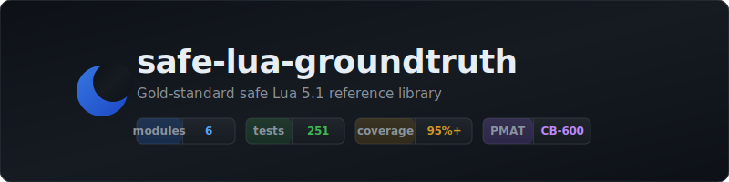

<p align="center"></p>

# Introduction

**safe-lua-groundtruth** is a gold-standard safe Lua 5.1 library demonstrating defensive programming patterns. It serves as a reference implementation verified by PMAT CB-600 compliance checks.

The library contains six modules covering the most common sources of Lua defects: nil-unsafe access, unvalidated input, shell injection, string concatenation in loops, implicit globals, and colon/dot confusion.

## Quick Start

Install dependencies:

```bash
# Lua 5.1 + luarocks
sudo apt install lua5.1 luarocks

# Test framework and tools
luarocks install busted
luarocks install luacheck
luarocks install luacov
```

Run quality gates:

```bash
make check      # lint + format check + tests
make coverage   # 95% minimum coverage on lib/
make bench      # performance benchmarks
```

## Using the Library

Add `lib/` to your Lua package path:

```lua
package.path = "lib/?.lua;" .. package.path
```

Require modules individually:

```lua
local guard    = require("safe.guard")
local log      = require("safe.log")
local validate = require("safe.validate")
local shell    = require("safe.shell")
local perf     = require("safe.perf")
local helpers  = require("safe.test_helpers")
```

## Project Layout

```
lib/safe/              # Production code (6 modules)
  guard.lua            # Defensive programming primitives
  log.lua              # Structured logging
  validate.lua         # Input validation with error accumulation
  shell.lua            # Safe shell execution
  perf.lua             # Performance patterns
  test_helpers.lua     # Testing utilities
spec/                  # busted test suites
  guard_spec.lua
  log_spec.lua
  validate_spec.lua
  shell_spec.lua
  perf_spec.lua
  test_helpers_spec.lua
  falsify_spec.lua     # Adversarial tests
benchmarks/
  perf_bench.lua       # Performance benchmarks
tools/
  check_coverage.lua   # Coverage enforcement
```

## Design Principles

1. **Dot syntax by default** — colon syntax only for stateful objects (`validate.Checker`)
2. **Local-cache all stdlib functions** at module top for performance and safety
3. **Every module returns a table `M`** — no global side effects
4. **95% minimum test coverage** enforced via `make coverage`
5. **Zero SATD** — no TODO/FIXME/HACK/XXX in production or test code
